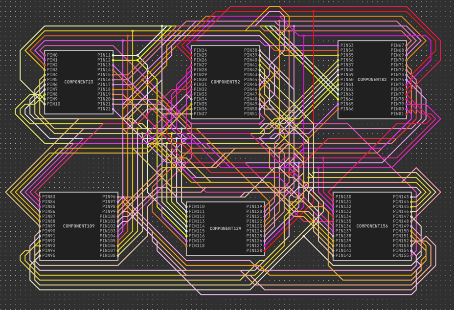

## How to get started:

Run `docker-compose up --build`

This will spin up a backend nodejs server on port `3000`
and a postgresql database on port `5432`

Navigate to `localhost:3000` in a browser, ideally chrome.

### Some details on the schema of the netlist:

The parent structure looks like this:

```json
{
  "connections": [],
  "nets": [],
  "components": []
}
```

nets are arrays of the following objects.
They have names and unique ids.
The netType can be "NORMAL" | "PWR" | "GND"

```json
{
  "id": "295",
  "name": "net295",
  "netType": "PWR"
}
```

components are arrays of the following objects.
They also have unique ids and names. Components also
contain a list of pins.

```json
{
  "id": "56",
  "name": "component56",
  "pins": []
}
```

pins just hav a name, id and pinType.
pinType is the same as netType: "PWR" | "GND" | "NORMAL"

```json
{
  "id": "22",
  "name": "pin22",
  "pinType": "PWR"
}
```

connections are just pairs of pins and nets. Both are referenced
by id:

```json
{
  "pinId": "20",
  "netId": "391"
}
```

### How to use the site:

- Click Home to go to the title page
- Click Random to see a randomly generated netlist on the fly
- Click debug to see some debug options
    - Click reset to actually drop all tables and reload the schema
    - Click generate test data to generate a bunch of random users and netlists per users. The gui will display
      All the information related to what was generated.
        - Passwords and usernames are cached and when known you can click the user to login into a sample user
        - If the cache is blown, passwords are unretrievable and you will see <UNKNOWN> just regenerate the data if this
          happens.
- The right upper corner of the screen contains the login menu. It's intuitive
- As soon as you login you'll see a collapsible side bar to the left that allows you
  to select a netlist to view and upload a netlist if you wish as well.
- Netlists can only be uploaded if they obey json. If they obey json but have other errors
  the verification algorithm can catch it. you will see giant error message with all verification errors and the netlist
  will
  not render.
- When viewing a netlist you can click and drag and use the mousewheel to zoom in.

### Some details of the website.

It's your standard crud web page. Users and NetLists in the database.
The netlists are stored directly in JSONB columns of postgresql

The unique thing about the page is how it renders the netlists.

You'll see things like this:



Which is actually really complicated to draw. All of this happens
on the front end to keep the backend simple and offload as much
computations to the browser.

The algorithm to draw the paths goes like this:

1. Place components on a grid.
2. Uses Dijkstra's algorithm to find the shortest path between
   two pins.
3. Then for all other pins on the same net, find the shortest path.
   between that pin and any other pin or path on the same net that's already been drawn
4. All cells in the grid occupied by a component have cost infinite.
5. Turning when traveling through the grid costs 1 point, so the algorithm
   biases against turning.
6. Crossing another wire on the grid costs 999 points, so the algorithm won't
   touch or cross another wire unless it absolutely has to.
7. Traveling diagonally costs 3 points, traveling horizontally costs 2 points. The algorithm biases towards
   horizontal and vertical paths, but often diagonal paths cost 3 points when the same path costs 4 points when done
   horizontally and vertically. By adjusting the cost this way, I prevent the path from excessively zigzagging along
   diagonals.
8. Total cost of one node movement = direction_travelling + intrinsic_cost_of_cell(wires, components) + did_wire_turn.
   The algorithm
   minimizes this cost as it heads towards the nearest goal point.

Overall, the algorithm above produces wiring's that uses space most efficiently while attempting
to avoid drawing lines on top of each other as much as possible.

### Optimizations

Dijkstra's algorithm is expensive If the grid is N\*N and we have M components with each component having P pins,
Then the cost of the algo is O(N^2\*M\*P\*N^2) for one netlist. This visibly takes 2 or 3 seconds at a time to render
in your browser, but you will never actually see this loading time because of the optimizations I did.

All of these calculations are indeed happening on the front end, and you can click "Random"
as many times as possible and see that you never see any loading times or the main thread getting blocked

This is because I aggressively use threading to cache as many rendered diagrams as much as possible. On the browser
this concept of threading is done by something called "web-workers"

For the 'Random,' link, I have a Queue of 10 preloaded randomized diagrams. As soon as that queue shrinks in size,
multiple threaded
workers kick in to fill the queue. You have to click superfast to even see loading.

When you log in the system will display a menu of netlists. These are aggressively cached as well. If you have 8 cores
then there are 8 threads or more running at the same time behind the scenes to preload everything in the menu. So
you will rarely see a spinner.

You can actually open up the browser inspector and look at the console to see the workers in action.
I left debug output in place so what the workers do is actually observable via the console.

### verification

verification logic is located in `netlist/verification.ts`
it's pretty straightforward. All verification functions have the same function
signature of `(x: NetList) => TrueOrError`. Then a single aggregation function
aggregates all of these functions into a single large verify function that lists all
possible violations. It's straightforward to extend.

Zod is extensively used throughout the code both to generate types and do runtime checks on incoming types
from IO to make sure things are safe. Zod verifies whether the code fits the schema but logical violations
like a GND pin connected to a GND net will be caught by the verify function.

### Code organization

Since both backend and frontend code are in Typescript both the frontend and backend can share equivalent code

- backend-specific code is in the backend folder
- frontend-specific code is in the frontend folder
- Schemas and types defined for login and Netlists are in their respective folder
- NetListRender is a special netlist type that includes information how to draw the netlist.
  Although the code logic is independent of the frontend or backend, it is, in practice, used exclusively by the
  frontend. The wiring drawing algorithm is located here.
- JSX and React components mostly make up the frontend folder.
- see the public folder for the SQL schema used in the db.

## Conclusion

To be perfectly honest, I realize I got way too excited working on this project on the weekends and went a little
overboard with this assignment.
The complexity unfortunately ballooned. With something like this, unfortunately, you can't keep it simple because what
I did is just intrinsically complex and there's no reducing it further.

But given what I built, I kept it as simple as possible, and I segregated the complexity and kept it from leaking into
other portions of the code.

The sheer complexity just for a take-home likely makes it work against me as I remember you said it should be simple.
But Either way
I want to thank you for giving me such an interesting assignment. I learned a lot. I'm actually primarily
a backend developer, but I was able to go deep into the frontend as well for this assignment. 


